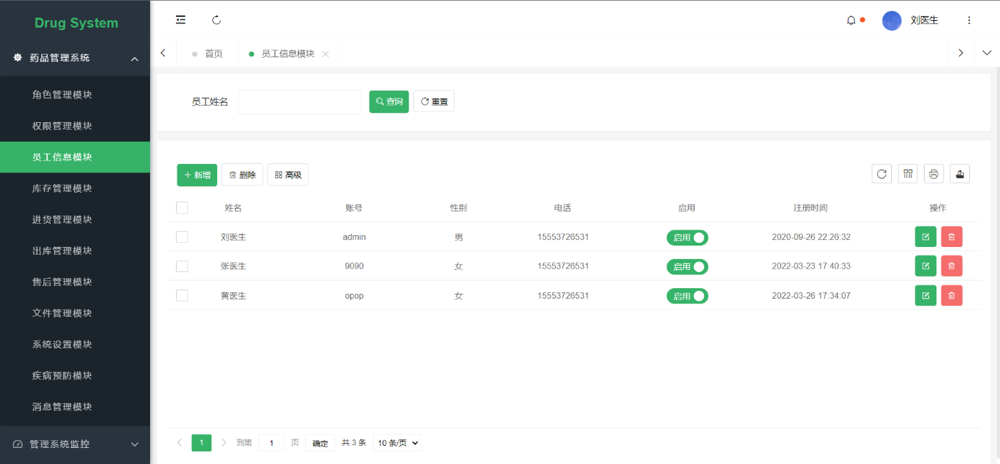

[](https://bestpractices.coreinfrastructure.org/projects/5995)

<div align="center">
<br/>

  <h1 align="center">
    Portal-Drug-System
  </h1>
 </div>


<div align="center">
  
</div>

#### 项目介绍  : 

Spring Boot + Security + MyBatis + Thymeleaf + Activiti +LayUI

#### 内置功能

1.  角色管理：用户是系统操作者，该功能主要完成系统用户配置。
2.  权限管理：配置系统菜单，操作权限，按钮权限标识等。
3.  员工信息：角色菜单权限分配、设置角色按机构进行数据范围权限划分。
4.  库存管理：对系统中经常使用的一些较为固定的库存数据进行维护。
5.  出库管理：对系统动态配置出库常用参数。
6.  进货管理：系统对进货的管理。
7.  售后管理：系统对售后的管理。
8.  文件管理：系统文件上传功能。
9.  疾病预防：根据出库数量进行提醒执行。
10. 邮件配置：邮件配置参照腾讯Smtp设置。
11. 消息管理：系统通知公告信息发布维护。
12. 系统监控：监视当前系统CPU、内存、磁盘、堆栈等相关信息。

#### 项目结构

```
Portal-Drug-System
│
├─annex  项目SQL文件
│
├─pear-common 公共模块
│  │
│  ├─config 框架集成配置
│  │
│  ├─constant 通用常量
│  │
│  ├─exception 异常处理
│  │
│  ├─plugins 封装组件
│  │
│  ├─tools 工具类
│  │
│  └─web WEB 处理封装
│
├─pear-entrance 启动模块
│  │
│  ├─api 通用接口
│  │
│  ├─secure 安全框架
│  │
│  └─EntranceApplication 启动类
│
├─pear-entrance 启动模块
│  │
│  ├─static 静态资源
│  │
│  ├─templates 页面文件
│  │
│  ├─logback-spring.xml 日志配置
│  │
│  ├─application-dev.yml 开发环境配置
│  │
│  ├─application-prod.yml 线上环境配置
│  │
│  ├─application-test.yml 测试环境配置
│  │
│  └─application.yml 配置文件
│  
└─pom.xml  Maven 配置

```

#### 快速上手

##### 下载

```
git clone https://github.com/ClaimomK/Portal-Drug-System.git
```

#### 预览项目

|                     |                     |
|---------------------|---------------------|
|   |   |
|   |   |
|   |   |
|   |   |
|   |  |
|  |  |
|  |  |
|  |  |

